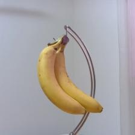

# -object-detection-with-picamera-and-keras
## description
The image output by [PiNoIR Camera Module](https://www.adafruit.com/product/1567) on an old [Raspbeery Pi 1 MODEL B+](https://www.raspberrypi.org/products/raspberry-pi-1-model-b/)  is sent to (https://www.adafruit.com/product/1567)[Classify ImageNet classes with ResNet50](https://keras.io/api/applications/#usage-examples-for-image-classification-models).

```
model = ResNet50(weights='imagenet')
```

reads ResNet50. It takes about seven minutes by Raspbeery Pi 1 MODEL B+...

```
        while True:
            with picamera.array.PiRGBArray(camera) as stream:
                camera.capture(stream, 'bgr')
                image = stream.array
                if WINDOW_WIDTH != ORG_WIDTH:
                    image = cv2.resize(image, (WINDOW_WIDTH, WINDOW_HEIGHT), interpolation = cv2.INTER_AREA) 
                cv2.imshow(windowName, image)
```

obtains BGR ordered OpenCV structured numpy array from PiCamera and show as an image with OpenCV imgshow()
Ref. (4.4. Capturing to an OpenCV object)[http://picamera.readthedocs.io/en/release-1.10/recipes1.html#capturing-to-an-opencv-object]

The obtained image is resized with OpenCV resize() to the window size.

```
            key = cv2.waitKey(12)
            #press Esc(27) to quit, press c(99) to classify
            if key==27:
                break
            elif key==99:
                print('classifying image...')
                t2 = time.clock() 
                image = image[: ,w_offset:w_offset + ORG_HEIGHT, :]
```

An inference is only executed at the time when the key c is pressed, because the inference takes about 50 seconds...
At first, an obtained image is resized to ORG_HEIGHT x ORG_HEIGHT x 3 as the same center as ORG_WIDGH by offsetting (ORG_WIDTH - ORG_HEIGHT)/2 pixels.


```
                image = cv2.resize(image, (224, 224), interpolation = cv2.INTER_AREA) 
                x = cv2.cvtColor(image, cv2.COLOR_BGR2RGB).astype(np.float32)
                array_to_img(x).save('classified.jpg')
```

resize ORG_HEIGHT x ORG_HEIGHT x 3 to 224 x 224 x 3.
OpenCV cvColor() transforms a BGR ordered image with uint type to a ResNet50 required RGB ordered one with float type.
The image sent to ResNet50 is stored with Keras array_to_img and PIL save() as classified.jpg.

```
                x = np.expand_dims(x, axis=0)
                x = preprocess_input(x)
                preds = model.predict(x)
                print('Predicted:', decode_predictions(preds))
                t3 = time.clock()
                print('inference :  %.3f s' % (t3 - t2))
```

The later is same as (Classify ImageNet classes with ResNet50)[https://keras.io/applications/].

## example



